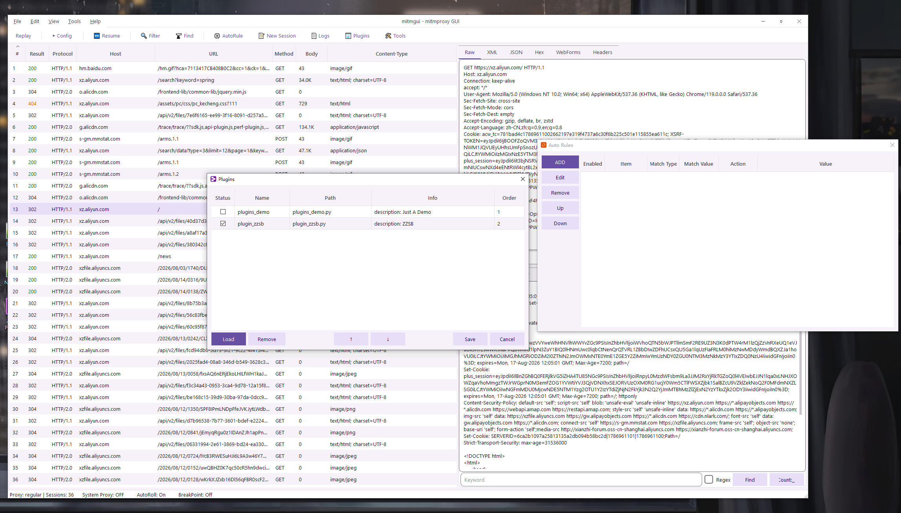

# MitmGUI

MitmGUI 是基于 mitmproxy 内核构建的桌面抓包、调试和流量改写工具。它使用 PyQt6 提供接近 Fiddler Classic 的原生界面，同时保留 mitmproxy 对 HTTP/1、HTTP/2、WebSocket、TLS 解密和脚本扩展的成熟能力。

项目目标是让常见代理调试工作直接在图形界面中完成：抓包、查看、过滤、重放、构造请求、断点修改、自动替换、插件扩展、Host/目标分离和常用编码工具都可以在一个窗口内完成。

## 界面预览



## 核心特性

### 抓包与查看

- 实时会话列表，支持排序、多选、自动滚动和颜色标记。
- 支持 HTTPS 解密，使用 mitmproxy CA 证书体系。
- 会话详情包含 Headers、Cookies、Query、WebForms、Raw、Preview、ImageView 等视图。
- Raw 视图支持搜索和编码切换，便于检查原始请求与响应内容。
- 支持会话保存、加载、清空和 URL 批量复制。

### 请求操作

- Replay：一键重放选中请求。
- New Session：从 Raw HTTP 请求快速构造新会话并发送。
- Edit：在 GUI 中编辑请求字段、请求头和请求体。
- SendTo：将请求转发到配置好的外部代理或调试工具。
- New Session 支持请求目标和 `Host` 头分离，例如连接到 `https://domain:8888/` 时仍可保留 `Host: domain:888`。

### 规则与拦截

- Filter Rules：按 URL、Host、方法、状态码等条件过滤会话。
- Breakpoint Rules：按规则拦截请求或响应，修改后再放行。
- Auto Rules：自动执行颜色标记、响应替换、请求/响应内容替换。
- URL Replace 保留显式 `Host` 头，不再因为修改 URL 自动覆盖 Header 中的 Host。
- Hosts Remapping 支持连接目标重映射，并可保留原始 Host 头：

```text
domain:888 domain:8888
```

上面的规则表示浏览器访问 `domain:8888` 时，代理实际连接 `domain:888`，但请求头中的 `Host: domain:8888` 保持不变。

### 插件系统

- Plugins 窗口支持加载、启用、禁用、卸载和排序 Python 插件。
- 插件支持 mitmproxy 风格 hook，例如 `request`、`response`、`websocket_message`。
- 插件 API 可访问会话列表、写入 Logs、打开 New Session。
- 内置插件日志会进入 Logs 窗口的 Plugin 分类，便于排查插件行为。

### Tools 工具箱

Tools 窗口提供常用调试工具：

- DNS：支持 UDP、TCP、DoH 查询，内置常用 DNS 服务器，查询异步执行，不阻塞窗口。
- Native2String：支持 Unicode escape 与普通字符串互转。
- Base64：支持 padding、逐行编码、严格解码和逐行解码。
- URL：支持普通编码、完整字节编码、逐行处理，解码时兼容 `+` 转空格。

### 配置与运行体验

- Config 窗口集中管理 HTTPS、连接、系统代理、SendTo 和通用设置。
- 支持系统代理一键切换，默认监听 `127.0.0.1:8080`。
- Logs 窗口按 Plugin、Info、Error、Debug 分类展示运行日志。
- `rules.py` 自定义脚本可热加载，适合实现一次性或高度定制的流量处理逻辑。
- 配置文件损坏或缺失时自动回退默认值，避免 GUI 无法启动。

## 安装与启动

运行环境：

- Python 3.12+
- Windows、macOS 或 Linux 桌面环境

安装依赖并启动：

```bash
pip install -r requirements.txt
python -m mitmproxy.tools.main mitmgui
```

开发模式安装后也可以直接运行：

```bash
pip install -e .
mitmgui
```

启动后点击工具栏的 Config，可以开启系统代理或调整监听地址、端口、HTTPS 解密等设置。

## 常用文件

这些文件位于程序运行目录，通常是启动 MitmGUI 时的当前工作目录。

| 文件 | 用途 |
| --- | --- |
| `Config.json` | GUI 设置、监听地址、HTTPS、系统代理、SendTo 配置 |
| `filter.json` | Filter Rules 规则 |
| `autos.json` | Auto Rules 规则 |
| `hosts.txt` | Hosts Remapping 规则，支持目标 host/port 映射 |
| `plugins.json` | 插件列表、启用状态和顺序 |
| `rules.py` | 自定义 Python 规则脚本 |
| `certs/` | mitmproxy CA 证书目录 |

## 快捷键

| 快捷键 | 功能 |
| --- | --- |
| `R` | 重放选中请求 |
| `E` | 打开 New Session |
| `F2` | 切换编辑模式 |
| `F11` | 切换断点拦截 |
| `Shift+F11` | 编辑断点规则 |
| `F12` | 切换系统代理 |
| `Ctrl+F` | 查找会话 |
| `Ctrl+U` | 复制选中请求 URL |
| `Ctrl+R` | 编辑 `rules.py` |
| `Ctrl+E` | 切换自动滚动 |
| `Ctrl+X` | 清空会话列表 |
| `Ctrl+0` | 清除选中会话颜色 |
| `Ctrl+1` - `Ctrl+9` | 为选中会话设置颜色 |

## 插件示例

插件是普通 Python 文件，可以放在任意位置后通过 Plugins 窗口加载。一个最小插件示例：

```python
def info():
    return {"description": "Log every request URL"}


def request(flow, api):
    api.logs.info(flow.request.pretty_url)
```

更多示例可参考 `plugins/` 目录。

## 致谢

MitmGUI 的代理核心、协议解析和证书体系基于开源项目 [mitmproxy](https://github.com/mitmproxy/mitmproxy)。
